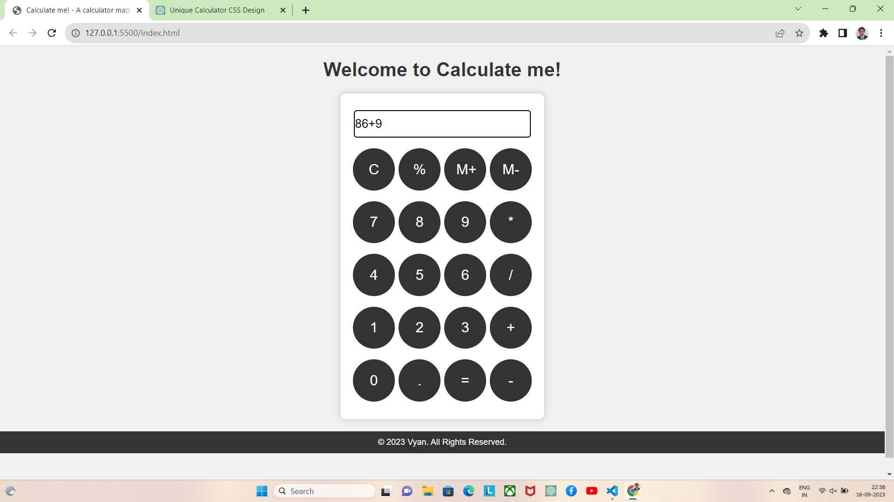

# Calculate Me! - A Simple Calculator

Welcome to Calculate Me!, a web-based calculator project.

## Overview

This project is a basic calculator implemented using HTML, CSS, and JavaScript. It provides a simple user interface for performing mathematical calculations.

## Features

- Addition, subtraction, multiplication, and division operations.
- Percentage calculation.
- Memory storage with M+ and M- buttons.
- Clear button (C) to reset the input.
- Error handling for invalid expressions.
